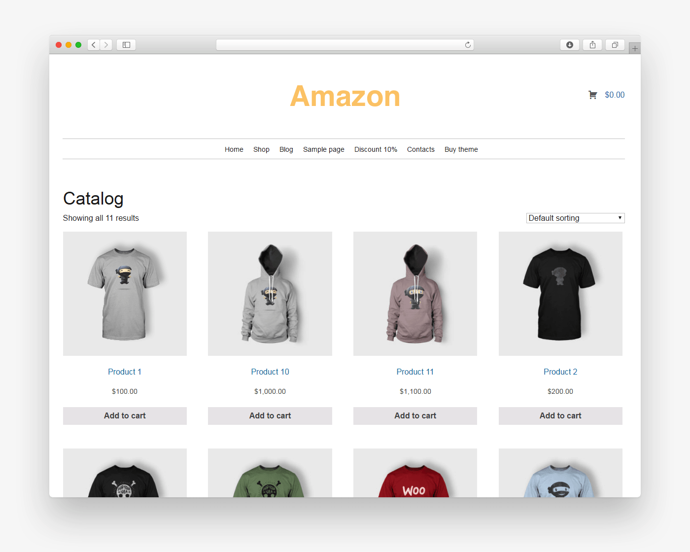

# Amazone Clone

You'll be creating your own version of Amazon! This app will consist of a front end JS webpage and a backend Express server.

## Setup
Install Express: 
`npm install express`
Install all dependencies: 
`npm install`

Run server: 
`npm start`

## Requirements
* The user can view all the products
* The user can filter the products

## Mockup

## Class Diagram
|Product|
| - |
| id: number |
| name: string |
| price: number |
| img: string |
| description: string |

## Service Contract
|Method|Path|Response|
|-|-|-|
| GET | /products | Product[] |
| GET | /product/:id | Product |

## Submission
Push to GitHub and create a pull request
